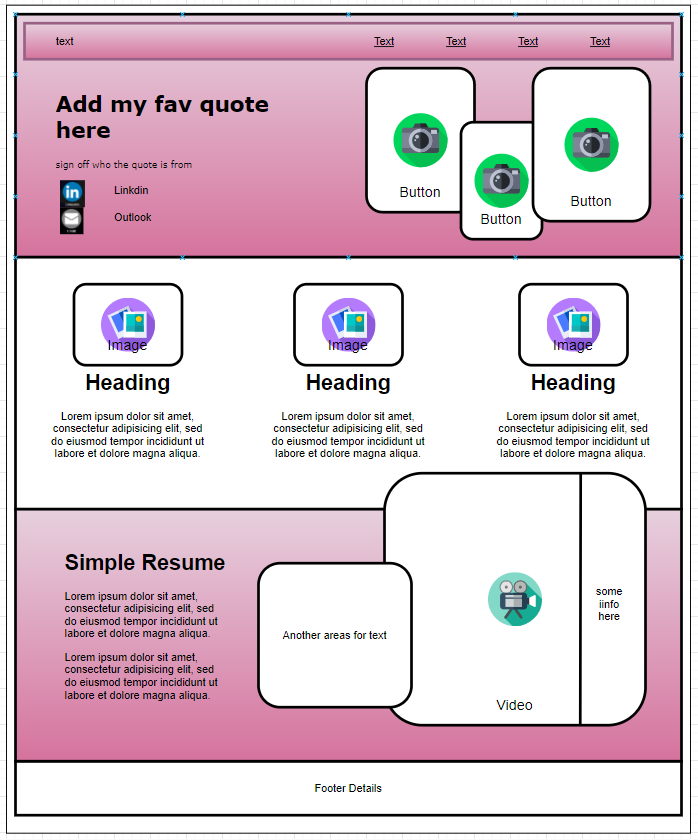
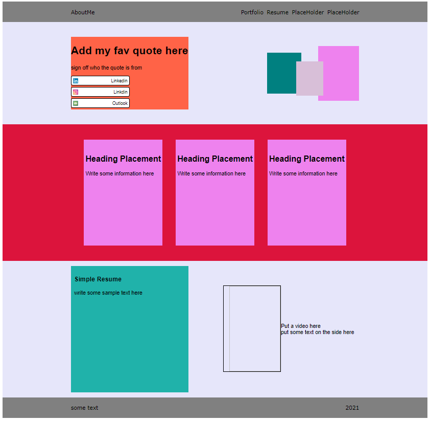

# Homework_week2

## About Me Project

For the second weeks homework students were required to build an "about me" website which is used to showcase what they have learnt during Bootcamp.
The website will start off as a shell and over the course of the Bootcamp program the placeholders will be filled with completed projects.
The end result is to have a fully functional website that the student can showcase to a prospective employer to validate their skills and talent.

In this project i want to demonstrate the following that i learnt in week1 and week2 class:

* semantics
* selectors
* various CSS styling 
* flexbox-styling
* Psudo classes 

(just to name a few)
 

To begin with i started by searching the website for a style that i liked and then tried to replicate the website's style and format.

The website style i like is linked here: 
https://about.me/

The next step i took is to wireframe the design so i could start constructing the template in HTML by creating boxes/containers as place holders.

My wireframe:

Then i proceeded to create my containers in HTML to show where i will place my images and text.

My HTML container:

The final product will change over the next 6 months as i improve on my skills in Bootcamp.
The final website can be viewed at: [deployed website URL here]

